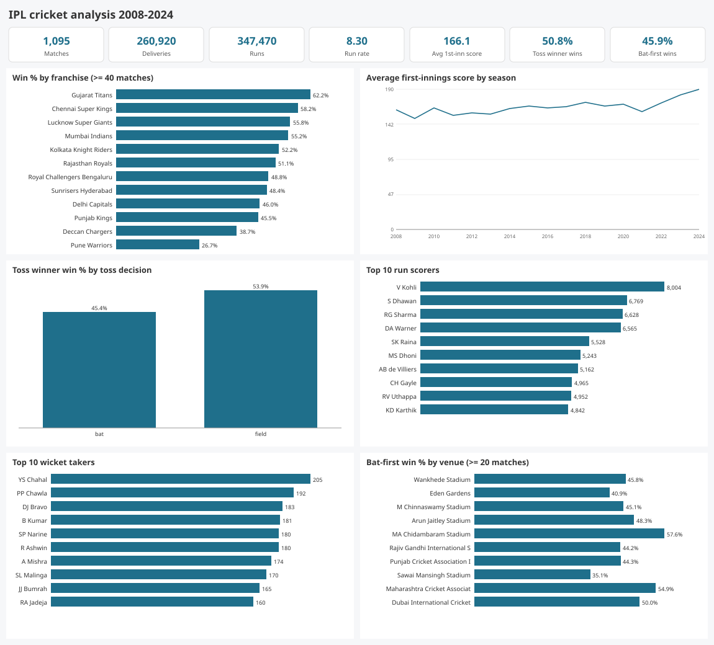
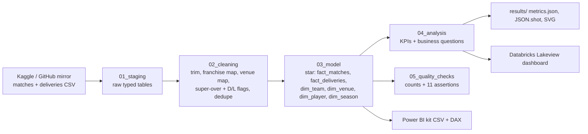

# da-learn-13 · IPL cricket analysis (2008–2024)

An end-to-end data-analyst project on **every IPL match and every ball from 2008 to 2024**: 1,095 matches and 260,920 deliveries. Raw CSVs go through staging, cleaning (franchise renames, venue-name variants, super overs, D/L, no-results) and a star schema. Analysis SQL then answers questions about team win rates, toss impact, batters, bowlers and venue effects. The same SQL runs locally on DuckDB and on Databricks SQL (Unity Catalog with a published Lakeview dashboard), and there is a Power BI kit for building the report yourself.



## Business questions
1. Which franchises win most consistently, and how do the title winners compare?
2. Does winning the toss help? Should the toss winner bat or field?
3. How has scoring changed season to season (the "impact player" era)?
4. Who are the most productive and efficient batters and bowlers?
5. Which phase of an innings (powerplay, middle, death) drives runs and wickets?
6. Do venues favour batting first or chasing, and how do captains react?

## Pipeline


## Headline insights (full data)
- **The toss barely matters on its own.** Toss winners won 50.83% of matches. Choosing to field, though, has paid off: 53.86% wins (377/700) against 45.38% when choosing to bat (177/390). Teams field first 64.29% of the time, peaking at 83.3% in 2018–19.
- **Chasing beats setting.** Bat-first sides won only 45.87% overall. MA Chidambaram (Chennai) is the exception at 57.6% bat-first wins; Sawai Mansingh (Jaipur) sits at 35.1%. Captains choose to field 90.1% of the time at Chinnaswamy, where the average first-innings score is 175.0.
- **Scoring has exploded.** The average first-innings score went from 150.3 (2009) to 182.2 (2023) and 189.6 (2024). Death overs run at 9.96 runs per over against 7.85 in the powerplay, and a wicket falls on 8.46% of death balls compared with 3.99% in the powerplay.
- **Consistency.** CSK win 58.23% (138/238, 5 titles) and MI 55.17% (5 titles). Gujarat Titans have the best rate of all, 62.22% in 45 matches. Pune Warriors are the weakest at 26.67%.
- **Players.** Kohli has 8,004 runs (SR 131.97, average 38.67, 8 hundreds). Russell has the highest strike rate among batters with at least 1,500 runs, 174.93. Chahal has the most wickets, 205 (economy 7.84). Narine has 180 wickets at an economy of 6.73.

Full tables are in [results/RESULTS.md](results/RESULTS.md) and [results/metrics.json](results/metrics.json).

## How to run
```bash
pip install -r requirements.txt            # duckdb
python run_pipeline.py --source sample     # runs on the committed sample in data/raw (seconds)
python scripts/download_full_data.py       # ~72 MB into data/raw_full, SHA-256 verified
python run_pipeline.py --source full       # full run -> results/, powerbi/data/, data/clean_full/
```
- **Databricks:** see [databricks/SETUP.md](databricks/SETUP.md). You upload the two CSVs to the volume `workspace.da_learn_13.raw`, run `databricks/ipl_pipeline_notebook.sql` on a SQL warehouse, and import `databricks/ipl_cricket_dashboard.lvdash.json`.
- **Power BI:** see [powerbi/BUILD_GUIDE.md](powerbi/BUILD_GUIDE.md).

## Databricks
The notebook ran on Serverless Starter Warehouse against the full files (35 statements, 204 s). The dashboard **"da-learn-13 IPL cricket analysis"** has 2 counters and 6 charts and is published. All 10 table row counts match DuckDB exactly, and the KPI, assertion and analysis tables show 0 cell differences. See `databricks/run_outputs/duckdb_vs_databricks.json`.

## Repo layout
```
├── data/raw/                 committed sample (2024 final, overs 1-5) + data/README.md
├── sql/00..05                compat shim, staging, cleaning, star model, analysis, quality checks
├── run_pipeline.py           DuckDB runner (sample | full)
├── scripts/                  project config, SVG charts, Databricks builder, download + sample makers
├── databricks/               notebook (.sql), Lakeview dashboard (.lvdash.json), SETUP.md, run_outputs/
├── powerbi/                  star CSVs (sample-sized), measures.dax, model.md, dashboard_spec.md, BUILD_GUIDE.md
└── results/                  RESULTS.md, metrics.json, JSON.shot, charts/*.svg
```

## Caveats
- The mirror's deliveries file is space-padded. Cleaning trims every text field, and the committed sample is stored already trimmed.
- Franchise renames are mapped to current names (19 raw names become 15 franchises): Delhi Daredevils → Delhi Capitals, Kings XI Punjab → Punjab Kings, Royal Challengers Bangalore → Bengaluru, and Rising Pune Supergiant(s) are merged. Venue spellings collapse from 58 raw strings to 36 venues.
- Super-over balls (161) are excluded from batting and bowling stats. The 5 no-results are excluded from win-rate denominators.
- The source has 71 matches for 2024, because washed-out games are absent.

## Complete dataset
- **Kaggle page:** https://www.kaggle.com/datasets/patrickb1912/ipl-complete-dataset-20082020 (IPL Complete Dataset 2008–2024)
- **Mirror used (exact URLs):**
  - https://raw.githubusercontent.com/avinashyadav16/ipl-analytics/main/matches_2008-2024.csv
  - https://raw.githubusercontent.com/avinashyadav16/ipl-analytics/main/deliveries_2008-2024.csv
- **Licence:** the Kaggle page states none. The ball-by-ball data originates from Cricsheet (https://cricsheet.org), which is ODC-BY 1.0. Use it for learning, with attribution.
- **Total size:** 72,308,219 bytes (~72.3 MB)
- **Files:** `matches_2008-2024.csv` (223,635 B, 1,095 rows) and `deliveries_2008-2024.csv` (72,084,584 B, 260,920 rows)
- **Download:** `python scripts/download_full_data.py` (writes to data/raw_full/ and verifies SHA-256)
